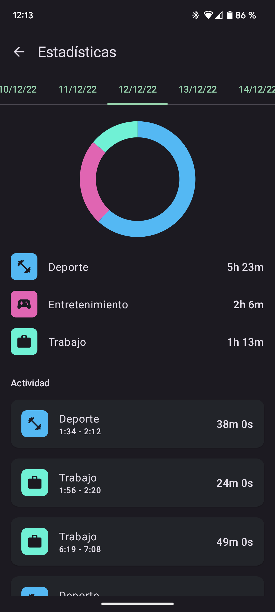
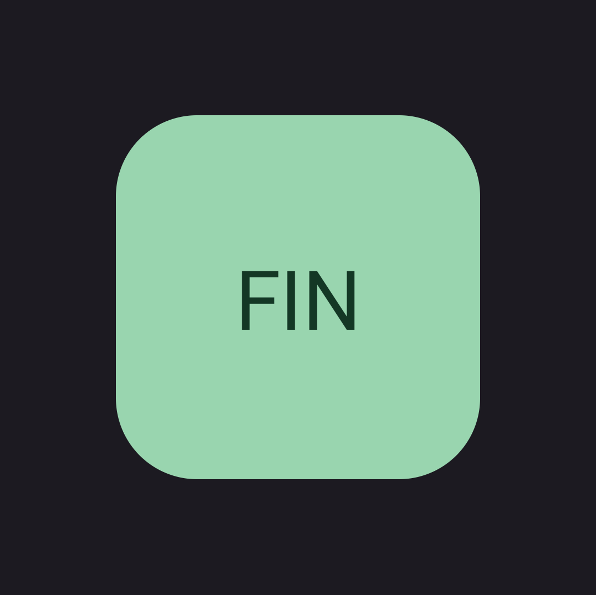

# Factorial Mobile Challenge

This is a Technical Challenge for Factorial. Definition here: [CHALLENGE.md](.github/CHALLENGE.md)

### How to install
1. Download the apk from GitHub releases in your Android device: [Releases](https://github.com/eliseo-juan/factorial-challenge-android/releases) 
2. Install it by using a FileManager (it could ask for permission, etc)
3. In the main screen, there is a 3-dot button, to fill the database with random slots

# Solution

### Overview

I've created a simple application, it wants to be as simple as possible, letting you to START and END without any distraction. When you want to track your time, the last thing you need is a tool that waste your time.

When you finish tracking an slot, you can start again or categorize the last time. This way you decide when spend time in categorizing your time.

The app have 3 categories predefined, but you can also add your own categories.

When you have time tracked, you can check how many time you spend in each category each day. Also you can check al your time slots past days.

### [Material You](https://material.io/blog/announcing-material-you) (Colors based on your device theme)

This app is the perfect tool to anyone that wants to have the control of their time, so being a tool, could be interesting to use their personal colors.

### Screenshots

  
   
  

  
   
  

### Network

*Strategy*: 
For this Tech Test, the focus has been in local storage, using network to save all the tracked slots. 
It do not have an offline support, that could be cool, how I would do that is explained here: [Project](https://github.com/users/eliseo-juan/projects/1/views/1) 

Trying to implement some network methods, I've implemented developed in two ways that follow `NetworkTrackedSlotDatasource`,
in this example we are Injecting the Network datasource that could be:
- `FirebaseTrackedSlotDatasource`: That uses firebase to uploading the tracked slots.
- `ServiceTrackedSlotDatasource`: Using a standard REST API datasource. (Not working because we don't have an API)

### Smoke Tests

As you can check in the second screenshot, I've added some smoke test with a cool feature. Automagic tracking, based on geofences or wifi network.
I didn't developed this features, but I want to "validate" this kind of features before implementing it. (Honestly I'm not tracking data, but this it's an example of using smoke tests)

### Some interesting details

Using main button to indicate the state. Pretty visual IMHO:

    
    

I didn't created a dialog to modify a Tracked Slot, because this is a Tech Test, but probably I would use this component:

    

The magic of using compose and creating components in an easy way.

### Possible next steps

This app has a lot of possibilities, I'm adding some of the possible next steps in this Project: [Project](https://github.com/users/eliseo-juan/projects/1/views/1)

# Architecture

This project has been developed following CLEAN and SOLID principles.
* Having a clear separation between layers.
* Decoupling code using Dependency Injection.
* Using a composable pattern for navigation.
* Two different presentation approach (with the purpose of showing 2 ways): `AnalyticsScreen` with MVI, `CategoryListScreen` with MVVM

### Compose
The future and the present of modern Android development. With the adventages of using a declarative approach.
I feel very confident with compose, I think it greatly reduces development times, and it allow to reuse views in a super easy way.

# Libraries

I want to explain a bit about the libraries I used in this project and how:

### Dependency Inversion: [Hilt](https://developer.android.com/training/dependency-injection/hilt-android)

Becoming the standard way of handling with coupling in Android. I previously
used [Koin](https://insert-koin.io/) but Hilt is having more and more support from the community.

### Database & ORM: [Room](https://developer.android.com/jetpack/androidx/releases/room)

Room provides an abstraction layer over SQLite to allow fluent database access while harnessing the full power of SQLite.

### Local Preferences: [JetPack DataStore](https://developer.android.com/topic/libraries/architecture/datastore)

JetPack DataStore is the fastest and safest way of handling user preferences, in this case I'm using it to handle start and end dates when tracking.

### Async Flow: [Flow & Coroutines](https://kotlin.github.io/kotlinx.coroutines/kotlinx-coroutines-core/kotlinx.coroutines.flow/-flow/)

The standard way of handling async calls and make a reactive app.

### ExternalStorage: [Firebase Firestore Database](https://firebase.google.com/products/firestore)

The best way of creating an external DB, and sync the data.

### Network: [Retrofit](https://github.com/square/retrofit)

One of the most used libraries for network calls, I feel very confident with this library, and I use
it in all my projects.

### Testing Mockito: [Mockito](https://site.mockito.org/)

I don't know why but I have a slight preference for Mockk over Mockito, but this time I've used Mockito.
